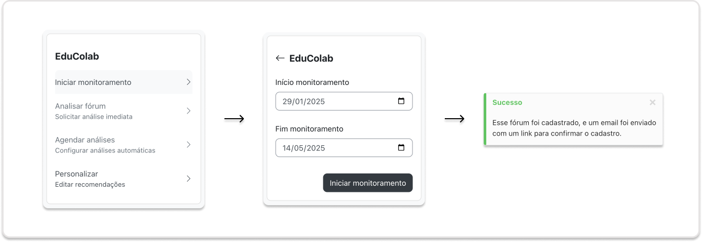
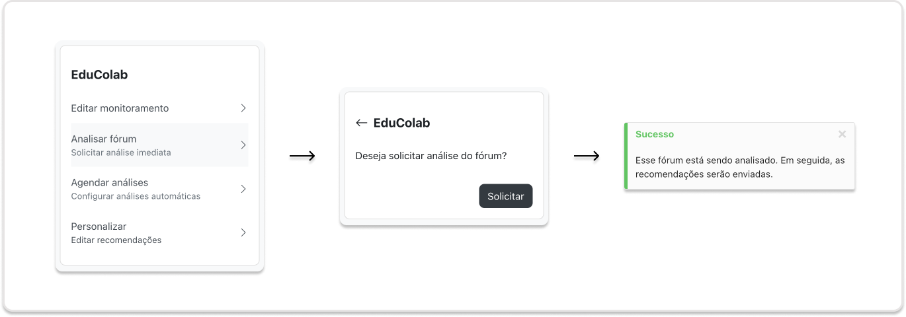
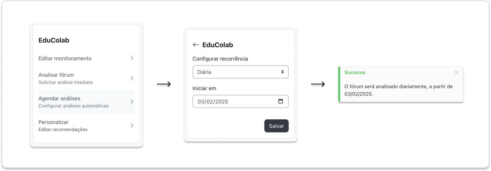
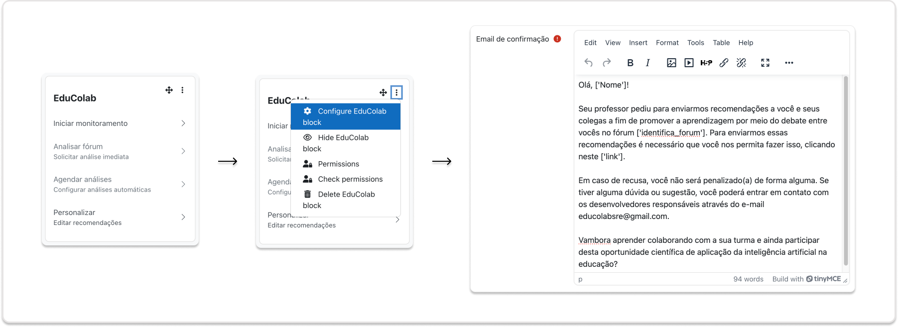

# Plugin EduColab para o Moodle #

O **EduColab** é um plugin do tipo bloco para o Moodle que integra um Sistema de Recomendação Educacional (SRE), automatizando a análise de fóruns de discussão e promovendo a aprendizagem colaborativa. Com ele, professores podem monitorar a participação dos alunos e receber recomendações personalizadas que ajudam a estimular o engajamento nas discussões.

---

## 📚 Sumário

- [Funcionalidades](#funcionalidades)
  - [📥 Cadastro de Fóruns](#-cadastro-de-fóruns)
  - [📊 Análise de Fóruns](#-análise-de-fóruns)
  - [🔁 Agendamento de Análises Automáticas](#-agendamento-de-análises-automáticas)
  - [✏️ Personalização de Recomendações](#-personalização-de-recomendações)
  - [🔧 Integração Técnica](#-integração-técnica)
- [📦 Instalação via arquivo ZIP (upload manual)](#-instalação-via-arquivo-zip-upload-manual)
- [🛠️ Instalação manual (diretório do servidor)](#️-instalação-manual-diretório-do-servidor)
- [📄 Licença](#-licença)

---

## Funcionalidades

### 📥 Cadastro de Fóruns
- Seleção de fóruns existentes no curso.
- Definição do período de monitoramento.
- Solicitação automática de consentimento dos alunos por e-mail.

### 📊 Análise de Fóruns
- Execução manual ou automática de análises das mensagens postadas.
- Geração de índices de colaboração com base em técnicas de análise conversacional.
- Envio automático de recomendações por e-mail a alunos e professores.

### 🔁 Agendamento de Análises Automáticas
- Permite definir a frequência das análises (diária, semanal, quinzenal, etc.).
- Utiliza tarefas programadas no Moodle para executar as análises nas datas agendadas.

### ✏️ Personalização de Recomendações
- Edição do conteúdo dos e-mails de confirmação enviados aos estudantes.
- Uso de variáveis dinâmicas no corpo do e-mail para personalização das mensagens.

### 🔧 Integração Técnica
- Desenvolvido em **PHP** como bloco do Moodle.
- Comunicação com o SRE (implementado em **Python**) por meio de uma **API REST** escrita em **Node.js + Express**.

---

## 📦 Instalação via arquivo ZIP (upload manual)

1. Acesse sua instalação do Moodle como administrador e vá até _Administração do site > Plugins > Instalar plugins_.
2. Envie o arquivo ZIP com o código do plugin. Você só será solicitado a preencher informações adicionais se o tipo de plugin não for detectado automaticamente.
3. Verifique o relatório de validação do plugin e finalize a instalação.

## 🛠️ Instalação manual (diretório do servidor)

O plugin também pode ser instalado manualmente copiando o conteúdo deste diretório para:

    {seu/moodle/dirroot}/blocks/educolab

Depois disso, acesse o Moodle como administrador e vá até _Administração do site > Notificações_ para concluir a instalação.

Alternativamente, você pode executar o seguinte comando no terminal:

    $ php admin/cli/upgrade.php

para concluir a instalação via linha de comando.

## 📄 Licença

© 2025 Gabriel Lima <gabriel.lima6@estudante.ifb.edu.br>

Este programa é um software livre: você pode redistribuí-lo e/ou modificá-lo sob os termos da Licença Pública Geral GNU, conforme publicada pela Free Software Foundation, na versão 3 da Licença ou (a seu critério) qualquer versão posterior.

Este programa é distribuído na esperança de que seja útil, mas **SEM NENHUMA GARANTIA**, sem mesmo a garantia implícita de **COMERCIALIZAÇÃO** ou de **ADEQUAÇÃO A UM PROPÓSITO ESPECÍFICO**. Veja a Licença Pública Geral GNU para mais detalhes.

Você deve ter recebido uma cópia da Licença Pública Geral GNU junto com este programa. Caso contrário, consulte: [https://www.gnu.org/licenses/](https://www.gnu.org/licenses/)
